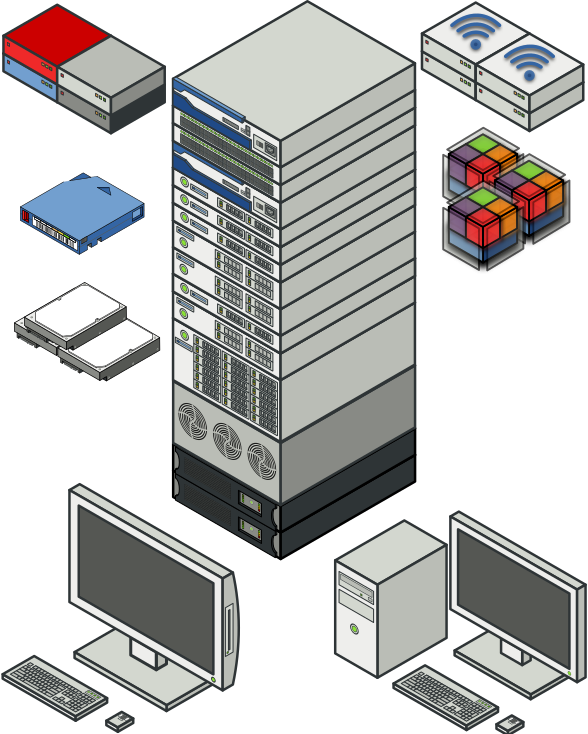

diagram-icons
=============

:imagesdir: .
:iconsdir: {imagesdir}
:icons: font

SVG-based computer and server icons for diagrams, presentations, etc. Made in Inkscape using an axonometric view.

* Scalable vector-based graphics are in `scalable`
* Pre-exported PNGs in different sizes can be found under `png`
* Pull requests for changes/enhancments/additions are welcome

TIP: Rackmount items are designed to be visually stackable if desired, or used separately.

[NOTE]
====
This project is CC-BY-SA 4.0; for more information, see `LICENSE`.

image::http://i.creativecommons.org/l/by-sa/4.0/88x31.png[]
====
